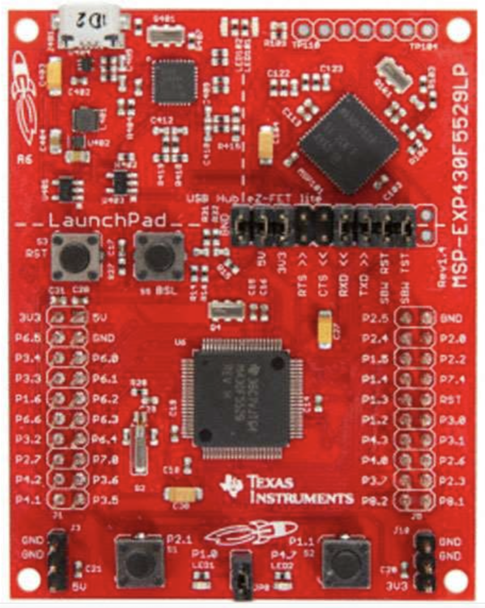
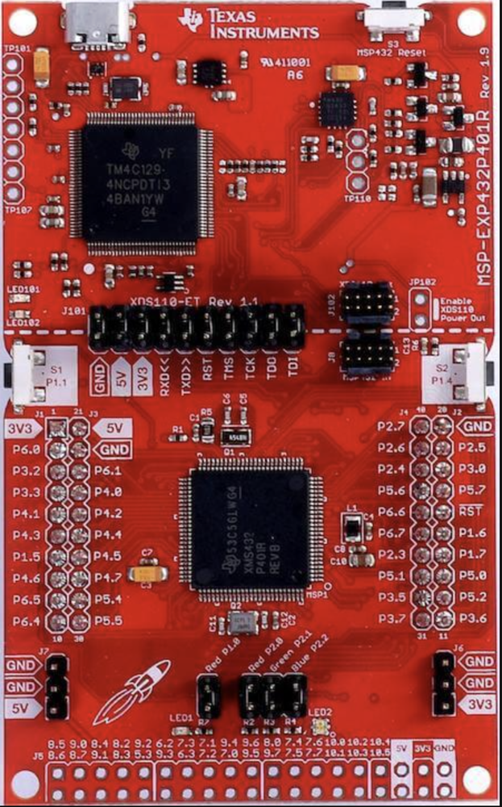
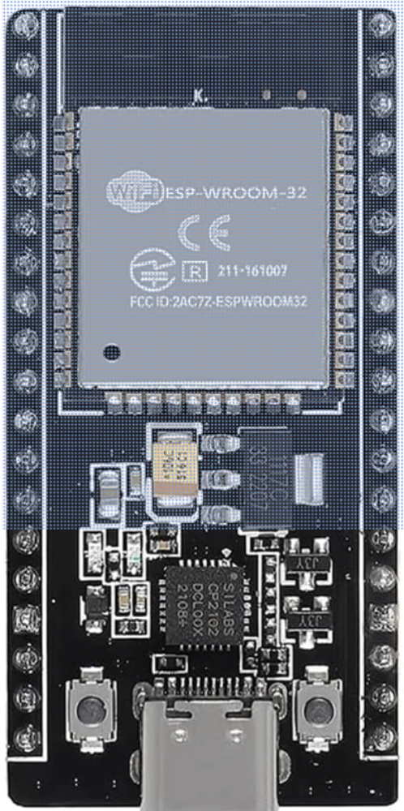

# GNOR

##### GNOR Description
The Great Navel Orange Race (GNOR) is an annual competition held at UCF every year for the second intro to engineering course. The project involves students building a boat, submarine, or other watercraft that autonomously carries an orange around the reflection pond.
The TI Innovation lab is providing students with TI microcontroller boards (MSP430f5529 LaunchPad, MSP-EXP432P401R LaunchPad) and sensors (TI Sensor Hub) for use in their watercrafts. These components empower students to control servos, provide signals for high power relays and ESCs, measure angle change relative to starting angle, look at accelerometer data, and more.
This repository provides everything needed to get started using these components. This includes example code, pinouts, and more. If you have any questions or are having trouble getting started, you can find help at the UCF Innovation Lab in ENGII room 112 9AM-10PM M-F and Saturday 10-5. 

##### Supported Boards

This project supports the following three microcontroller boards:

| MSP-EXP430F5529LP | MSP-EXP432P401R | ESP32-CP2102 |
|:-----------------:|:---------------:|:------------:|
|  |  |  |
| MSP-EXP430F5529LP | MSP-EXP432P401R | ESP32-CP2102 |

##### Install Instructions
## Arduino IDE 2.x Setup

This project requires additional board package URLs, standard Arduino libraries, and custom ZIP libraries. Follow the steps below to fully configure Arduino IDE 2.x.

### Step 1 - Open Arduino IDE Settings

1. Open the **Arduino IDE**.
2. On **macOS**, click **Arduino IDE** in the top menu bar, then select **Settings**.
3. On **Windows** or **Linux**, click **File**, then select **Preferences**.
4. The Arduino IDE settings window will open.

### Step 2 - Add the Additional Boards Manager URLs

1. In the settings window, locate the field labeled **Additional Boards Manager URLs**.
2. Copy and paste the following URLs into that field, with **one URL per line**:

       https://raw.githubusercontent.com/Andy4495/TI_Platform_Cores_For_Arduino/main/json/package_energia_optimized_index.json
       https://raw.githubusercontent.com/espressif/arduino-esp32/gh-pages/package_esp32_index.json

3. If the field already contains other URLs, do not delete them. Add these new URLs on separate lines below the existing entries.
4. Click **OK**, or close the settings window to save your changes.

### Step 3 - Install the Required Board Packages

Install only the board package(s) that match the board(s) you are using.

#### MSP-EXP430F5529LP
1. In the Arduino IDE, click **Tools**.
2. Select **Board**, then click **Boards Manager**.
3. In the search box, type **TI Platform Cores**.
4. Locate the **TI Platform Cores for Arduino** package (added via the board manager URL in Step 2).
5. Click **Install** and wait for the installation to finish.
6. To select this board: **Tools → Board → Energia MSP430 Boards → MSP-EXP430F5529LP**

#### MSP-EXP432P401R
1. In the Arduino IDE, click **Tools**.
2. Select **Board**, then click **Boards Manager**.
3. In the search box, type **TI Platform Cores**.
4. Locate the **TI Platform Cores for Arduino** package (added via the board manager URL in Step 2).
5. Click **Install** and wait for the installation to finish (same package as MSP430 — skip if already installed).
6. To select this board: **Tools → Board → Energia MSP432 EMT RED Boards → MSP-EXP432P401R**

#### ESP32-CP2102
1. In the Arduino IDE, click **Tools**.
2. Select **Board**, then click **Boards Manager**.
3. In the search box, type **esp32**.
4. Locate **esp32 by Espressif Systems**.
5. Click **Install** and wait for the installation to finish.
6. To select this board: **Tools → Board → esp32 → ESP32 Dev Module**

### Step 4 - Install the Required Libraries from Library Manager

1. In the Arduino IDE, click **Tools**.
2. Select **Manage Libraries...**
3. In the **Library Manager** search box, type **ESP32Servo**.
4. Locate **ESP32Servo** in the results list.
5. Click **Install** and wait for the installation to complete.
6. In the search box, type **NeoPixelBus**.
7. Locate **NeoPixelBus by Makuna**.
8. Click **Install** and wait for the installation to complete.
9. Confirm that both libraries are installed before continuing.

### Step 5 - Install Custom Libraries from ZIP Files

This project also requires the following custom libraries:

- [WS2812_MSP432](https://github.com/UCFInnovationLab/WS2812_MSP432/releases)
- [WS2812_MSP430](https://github.com/UCFInnovationLab/WS2812_MSP430/releases)
- [MPU6050](https://github.com/ucfinnovationlab/mpu6050/releases)

For each custom library, complete the following steps:

1. Open the library’s **Releases** page in your web browser.
2. Download the ZIP file for the latest recommended release.
3. Return to the Arduino IDE.
4. Click **Sketch**.
5. Select **Include Library**.
6. Click **Add .ZIP Library...**
7. Browse to the ZIP file you downloaded.
8. Select the ZIP file.
9. Click **Open** to install the library.
10. Repeat this process for each remaining custom library.

Using ZIP files from the **Releases** page is recommended because they provide a specific tested version of the library rather than the latest development snapshot from the repository.

### Step 6 - Restart the Arduino IDE and Verify Installation

1. Close the Arduino IDE.
2. Reopen the Arduino IDE.
3. Click **Tools → Board** and verify that the newly installed board packages are now available.
4. Click **Sketch → Include Library** and verify that the installed libraries appear in the library list.
5. Click **File → Examples** and check whether example sketches are available for the installed libraries.
6. Select your target board from the **Tools → Board** menu.
7. Open your project sketch.
8. Run a compile test to confirm that the required boards and libraries were installed correctly.

## Notes

- If the **Additional Boards Manager URLs** field already contains entries, keep them and add these new URLs on separate lines.
- Do not remove existing URLs unless you are sure they are no longer needed.
- If you previously installed older versions of the custom ZIP libraries manually, remove the older copies first to avoid duplicate library conflicts.
- After installation, example sketches may appear under **File → Examples**.
